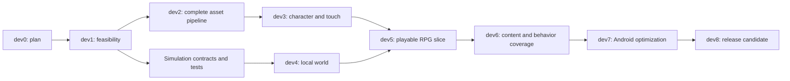

# خارطة تطوير my-veloren

**الحالة بتاريخ 2026-10-03: تخطيط فقط. جميع مراحل التنفيذ أدناه لم تبدأ.**

## 1. الهدف وحدود التعهد

الهدف لعبة أندرويد على Unity، قابلة للعب دون إنترنت، تستند إلى عالم وأصول وأنظمة
Veloren. المطلوب النهائي استيعاب جميع الأصول في خط الاستيراد، لا مجموعة مختارة فقط.
لكن هذا عمل إعادة تنفيذ تدريجي: Veloren ليست مشروع Unity، ومصدرها يتضمن محاكاة
وعالماً وخادماً محلياً وحركة إجرائية، لا مجرد خامات يمكن سحبها إلى المحرر.

نفصل ثلاثة إنجازات:

1. **مكتبة المصدر كاملة:** كل ملف له أصل وإصدار وبصمة وتصنيف.
2. **أصول Unity كاملة:** لكل نوع تحويل أو تفسير صحيح، مع اعتماديات وتقرير تغطية.
3. **اللعبة كاملة ضمن نطاق متفق عليه:** أنظمة العالم والشخصية والقتال والذكاء والحفظ
   تعمل فعلاً وتنجح في اختبارات الهاتف. تحقق (1) أو (2) لا يثبت (3).

لن نعد بتطابق العالم أو أنظمة الأصل دون اختبارات مقارنة. الاستثناء الحالي الواضح
هو اللعب الشبكي والحسابات العامة: المنتج المستهدف أوفلاين.

## 2. القرار المعماري المقترح

**Unity + محاكاة C# محلية مستقلة عن العرض + أدوات تحويل وقت التطوير.**

في Veloren الأصلية يبدأ وضع اللاعب الواحد خادماً في thread محلي. إعادة التنفيذ
المقترحة لا تستبدل هذا الخادم بخادم سحابي؛ تنقل مسؤولياته إلى محاكاة داخل التطبيق.
مجرد حذف شاشة تسجيل الدخول لا يصنع نسخة أوفلاين.

إعادة استخدام أجزاء Rust عبر native plugin تبقى خياراً بديلًا يحتاج تجربة وقراراً
موثقاً؛ لا ندخلها سراً إذا تعثر النقل إلى C#. يجب حسم الحدود في dev1.

## 3. ترتيب المراحل وبوابات القبول

| المرحلة | ما سيُنجز بعد التفويض | شرط العبور |
|---|---|---|
| **dev0 — هذه الخطة** | المعمارية، الجرد المرجعي، العقود، مصفوفة التغطية وتعليمات الوكلاء | مراجعة المالك؛ لا ملفات تنفيذ |
| **dev1 — إثبات المسار التقني** | حسم جدوى المعمارية والتوزيع، تثبيت الأدوات والإصدارات، مشروع Unity صغير، عينة أصل حقيقي، رسم ولمس وتجربة ARM64، حسم C#/Rust | قرار موثق حول توافق المكونات والتراخيص؛ أصل يظهر في APK على هاتف، ليس في المحرر فقط؛ تقرير أداء أولي وتوافق |
| **dev2 — مكتبة الأصول الكاملة** | اكتساب كل ملفات المصدر المثبت، الفهارس والبصمات والإشعارات، مستورد VOX وRON والصور والصوت والخطوط | جرد كامل بلا ملفات مفقودة أو pointers؛ كل فئة مطلوبة مدعومة؛ وجود عائق يجعل المرحلة جزئية لا مكتملة |
| **dev3 — شخصية وكاميرا وتحكم** | تجميع أجزاء الجسم والعتاد؛ حركة ومزج؛ كاميرا منظور ثالث ولمس؛ تصادم وتفاعل | شخصية حقيقية قابلة للتحكم؛ لا أجزاء بيضاء/مقلوبة/مختفية؛ اختبارات لمس متعددة |
| **dev4 — عالم محلي قابل للاستكشاف** | chunks وتوليد/تحميل العالم، حفظ seed، تضاريس وماء وأشجار ومواقع، streaming | استكشاف منطقة مرجعية بلا فتحات تصادم أو نمو ذاكرة غير محدود؛ نتيجة seed قابلة للتكرار |
| **dev5 — حلقة لعب RPG** | سلاح وعدو أولاً، قتال وضرر وموارد، غنائم وجرد وتجهيز وصناعة وموت/عودة | سيناريو لعب أوفلاين من البداية للنهاية؛ حفظ/إغلاق/استئناف يحافظ على الحالة |
| **dev6 — توسيع تغطية الأصل** | بقية فئات الأجسام والوحوش والأسلحة والقدرات والبيئات والمواقع والتفاعلات والمحاكاة | لا صف مطلوب بلا قرار واختبار في مصفوفة التغطية؛ لا إسقاط صامت لمحتوى |
| **dev7 — تحسين Android** | ذاكرة وحرارة وطاقة، جودة متدرجة، ضغط مناسب، صوت وإعدادات وتعريب وإتاحة | اجتياز أهداف الجهاز/الجودة المتفق عليها، لا أرقام مستنتجة من sandbox |
| **dev8 — مرشح إصدار** | اختبار تثبيت نظيف أوفلاين، ترقية الحفظ، توقيع ثابت، حزمة كاملة وتوثيق مشتري/مطور | مراجعة المالك + الأدلة + فحص محتويات APK/AAB؛ بعدها فقط إعلان الإصدار |

**تنبيه dev2:** وجود الملف في المكتبة لا يعني اكتمال سلوك مخلوقه.
إذا بقي محول ضروري غير مدعوم، لا تسمَّ المرحلة «استيراد كامل». يُسجل العائق
وتُراجع خطة المرحلة؛ لا تُخفَّض نسبة الهدف إلى عينة العرض.

## 4. الاعتماديات والعمل المتوازي

فريق الأصول يمكنه العمل بالتوازي مع المحاكاة بعد تثبيت العقود، لكن لا يُدمج محتوى
قبل اختباره. مطور واحد يملك تغييرات إعدادات المشروع والبناء لتجنب تضارب الوكلاء.
تحسين الأداء يبدأ بالقياس في dev1 وdev4؛ dev7 ليس أول مرة نفكر فيها بالأداء.

## 5. تعريف أول نسخة قابلة للعب

**نطاق dev5 المقترح، وليس وصفاً لشيء موجود:**

- شخصية واحدة مركبة من أصول Veloren الصحيحة مع سلاح وتجهيز ظاهر.
- منطقة مرجعية قابلة للتجوال، أرض وتصادم وماء وديكور.
- تحكم لمس وحركة وكاميرا وقفز وهجوم وتفاعل.
- عدو يعمل محلياً، ضرر وموت وغنيمة وجرد وتجهيز ووصفة صناعة واحدة.
- حفظ الشخصية والعالم ثم استئناف نفس التقدم بعد قتل التطبيق.
- أول تشغيل بعد تثبيت كامل في وضع الطيران؛ لا تنزيل إضافي أو حساب.

هذه **vertical slice**، وليست Veloren الكاملة. توسعة dev6 عمل مستقل وضروري.
حدود المنطقة وعدد الشخصيات والأسلحة في التجربة لا تحذف بقية الأصول من dev2.

## 6. ما يجب حسمه قبل كتابة اللعبة

1. هل هدف السلوك تطابق الأصل أم إعادة تنفيذ متكيفة مع الهاتف؟ الافتراض المقترح:
   الحفاظ على الأنظمة المطلوبة مع توثيق كل تبسيط؛ لا نسمي الاختلاف تطابقاً.
2. جهاز ARM64 متوسط وجهاز أضعف للاختبار، مع نسخة Android وميزانية التخزين.
3. اعتماد نسخة Unity نهائية: نسخة المشاريع السابقة مرشح للمقارنة وليست اختياراً
   أعمى؛ دعم Android الحديث و16 KB page size والمكتبات الأصلية يجب إثباته.
4. اعتماد renderer: URP مبسط مرشح؛ يفصل dev1 في الاختيار وفق الرسم والهاتف.
5. اختيار snapshot upstream مثبت، وترخيص كل أصل، وسياسة raw/LFS/archives.
   قبل نقل كود مشتق أو ربطه، تُحسم قابلية توزيع مكونات GPLv3 مع runtime الخاص بـUnity
   بقرار موثق ومراجعة مناسبة؛ هذا سؤال جدوى في dev1، لا مفاجأة تؤجل للإصدار.
   إذا تعذر المسار، نعود إلى المالك ببدائل ولا نغيّر شرط Unity من تلقاء أنفسنا.
6. حدود توافق الحفظ: صيغة Unity جديدة versioned؛ استيراد حفظ Veloren الأصلي
   ليس مضموناً ويحتاج مشروع تحويل مستقل إن طُلب.

## 7. متى نتوقف ونراجع؟

- إذا لم تعمل عينة voxel بموادها الصحيحة على ARM64: نصلح المستورد/الرسم قبل العالم.
- إذا لم يُثبت offline save/load: لا نوسّع المحتوى.
- إذا لم يتحقق هدف الذاكرة: نعدّل streaming/LOD والميزانيات قبل استيراد مخرجات ضخمة.
- إذا تعذر تفسير RON أو دلالات palette: نرجع إلى المصدر المثبت؛ لا نخمن.
- إذا اقتضى التنفيذ تغيير Unity أو إضافة Rust runtime أو حذف نظام أصلي: قرار
  معماري وموافقة، وليس تغييراً صامتاً.
- إذا غابت أداة أو رخصة بناء أو حصة جهاز: تُسجل NOT RUN مع السبب، لا PASS.

لا توجد مدة إنجاز أو تكلفة أو FPS مضمون في هذه الخطة. تقدير المراحل يصبح مفيداً
بعد قياسات dev1، لا اعتماداً على عدد أنوية جهاز البناء.
